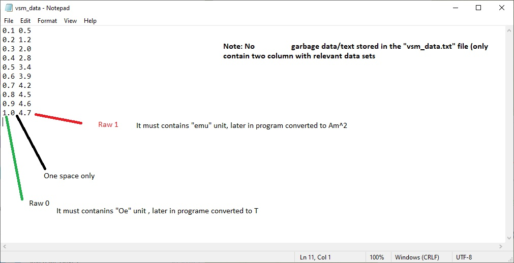

# VSManalyser
**A quick and portable way to analyze VSM data**
#
This is a Python script creates a graphical user interface (GUI) using the Tkinter library. The GUI allows the user to select a text file containing magnetic data from a Vibrating Sample Magnetometer (VSM) measurement. The script reads the data, converts the units to SI units, calculates key magnetic parameters (saturation moment, coercivity, remanence, magnetic moment, anisotropy constants, and magnetic susceptibility), and then displays the key parameters on both a plot and a text label in the GUI.

### Features:

* Open VSM measurement data in `.txt` format
* Convert units to SI units
* Calculate key parameters such as saturation moment, coercivity, remanence, magnetic moment, anisotropy constants, and magnetic susceptibility
* Fit the data to a model to extract anisotropy constants
* Plot the data and key parameters
* Save analysis parameters for later use
* Portable, no installation required

## Download

[Latest stable release.](https://github.com/abhijeetbyte/VSManalyser/releases/latest)

Releases and prereleases contain links to standalone packages
(and installers for full releases) for Windows
  
_Your computer must be running Windows 10 or newer._

* Portable version [Download v1.0](https://github.com/Abhijeetbyte/VSManalyser/releases/download/v1.0/VSManalyser.exe)

 

## VSM data file 

 
 

The script uses NumPy and SciPy libraries for numerical operations and curve fitting, and Matplotlib library for plotting. The GUI contains a single button that when clicked, opens a file dialog to select a text file containing magnetic data. Once the user selects a file, the script reads the data, calculates the key parameters, and displays them on the plot and a text label in the GUI.

The key parameters displayed in the text label include the saturation moment, coercivity, remanence, magnetic moment, anisotropy constants, and magnetic susceptibility. The plot shows the magnetic moment as a function of the magnetic field, and also displays the saturation moment, coercivity, and remanence as horizontal and vertical lines. 

The code is organized into a single function called `Main()`, which is called when the user clicks the button to select the file. The function contains all the code for reading the data, calculating the key parameters, and displaying the results in the GUI. 

Overall,  provides a simple but powerful tool for analyzing magnetic data from a VSM measurement.

## License

Copyright © 2023 Abhijeet kumar. All rights reserved.

Licensed under the [CC0-1.0 License](LICENSE).
